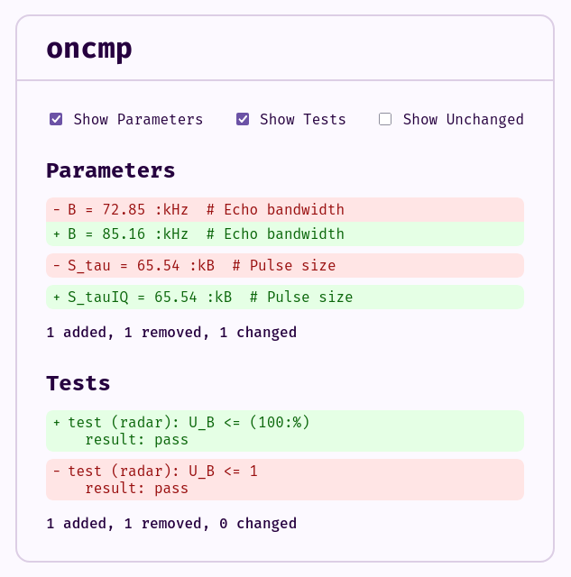

# oncmp (Oneil Compare)

Compare parameters and regression tests between two versions of [Oneil](https://github.com/careweather/oneil): a "legacy" run using `oneil regression-test` and a "current" run using `oneil eval` and `oneil test`. Useful for validating that a refactor or new implementation produces the same parameters and test outcomes.

## Requirements

<!-- TODO: improve this so that it better describes the requirements -->

- [Gleam](https://gleam.run/) (and `gleescript` for building the standalone binary)
- Two model repo checkouts: one for the old CLI, one for the new (for more details, see [_Model Repo Setup_](#model-repo-setup))
- A virtualenv (`.venv`) in each repo with `oneil` and/or other Python requirements installed

## Build & install

```bash
./install.sh ~/.local/bin
```

Ensure the target directory is in your `PATH`. To install under a different name:

```bash
BIN_INSTALL_NAME=my-oncmp ./install.sh ~/.local/bin
```

## Usage

```text
oncmp [OPTIONS]
```

**Options:**

| Option | Description |
|--------|-------------|
| `-h`, `--help` | Show help and exit |
| `--config <path>` | Path to config file (default: `./oncmp_config.toml`) |
| `-p`, `--params` | Show only parameter diffs |
| `-t`, `--tests` | Show only test diffs |
| `-i`, `--include-unchanged` | Include unchanged items in the output |
| `-e`, `--print-source-on-parse-error` | Print the output that is being parsed when a parse error is encountered |
| `-s`, `--serve` | Display the results in a web server instead of in the CLI |


The tool runs the old and new Oneil commands as configured, parses their output, diffs parameters and tests (respecting ignore lists), then prints the diff and a summary (added/removed/changed).


## Running the Server



When the `--serve` or `-s` option is provided, `oncmp` is run as a server, and
the output is displayed at on localhost on port 8000 (`127.0.0.1:8000`).

Each time the page is refreshed, `oncmp` runs its diff algorithm again and
displays the results. The page allows you to control what is displayed
dynamically using checkboxes.

In addition, it is possible to control whether or not the checkboxes should be
checked using query parameters. A value of `true` or `t` indicates that it
should be checked by default, any other value indicates that it should be
unchecked by default. Query parameters can be chained with `&`.

| Checkbox | Corresponding Query Parameter |
|-----------------|------------------------|
| Show Parameters | show_params |
| Show Tests | show_tests |
| Show Unchanged | show_unchanged |
| Show Error Source | show_error_source |

### Examples

```
http://127.0.0.1/?show_params=true
http://127.0.0.1/?show_tests=true
http://127.0.0.1/?show_error_source=false&show_unchanged=true
```

## Configuration file

Config is a single TOML file (default path: `./oncmp_config.toml`). Use `--config <path>` to override.

### Structure

```toml
[run]
old_repo = "/path/to/old/model/repo"
new_repo = "/path/to/new/model/repo"
model_file = "main_model.on"

[ignore]
params = ["param_name_to_ignore", "another_param"]
tests = ["test_name_to_ignore"]
```

### Sections and keys

| Key | Required | Description |
|-----|----------|-------------|
| **`[run]`** | | Paths and model used when invoking Oneil. |
| `run.old_repo` | Yes | Directory of the legacy model repo. The tool runs `cd <old_repo> && source .venv/bin/activate && cd model/ && oneil regression-test <model_file>`. |
| `run.new_repo` | Yes | Directory of the updated model repo. The tool runs `cd <new_repo> && source .venv/bin/activate && cd model/ && oneil eval <model_file> --print-mode all --no-header --no-test-report && oneil test <model_file> --no-header --recursive`. |
| `run.model_file` | Yes | Model file path passed to both `oneil regression-test` (legacy) and `oneil eval` / `oneil test` (current). Relative to the `model/` subdirectory of each repo. |
| **`[ignore]`** | | Names to exclude from the diff. This is useful if you have parameters or tests with changes that you have verified are correct. Omit the section or use empty arrays to diff everything. |
| `ignore.params` | No | List of parameter names to ignore when comparing parameters. Default: `[]`. |
| `ignore.tests` | No | List of test names to ignore when comparing tests. Default: `[]`. |

### Example

```toml
[run]
old_repo = "/home/me/veery-legacy"
new_repo = "/home/me/veery-refactor"
model_file = "models/example.on"

[ignore]
params = ["already_verified_param"]
tests = ["known_flaky_test"]
```

## Model Repo Setup

The purpose of `oncmp` is to perform regression testing on two different
versions of Oneil. Specifically, the old version of Oneil is
[0.14.1](https://github.com/careweather/oneil/releases/tag/0.14.1), while the
new version is
[0.16.0](https://github.com/careweather/oneil/commit/d891d7b1555a938dfe6bb6a3cab180a502620d5c)

For `oncmp` to work, you need to set up two versions of the repo with the models
that you'd like to perform regression testing on. The first repo, stored in the
config file under the key `run.old_repo`, should have Oneil 0.14.1 installed in
the virtual environment. The second repo, stored in the config file under the
key `run.new_repo`, uses Oneil 0.16.0, which should be installed on PATH.
